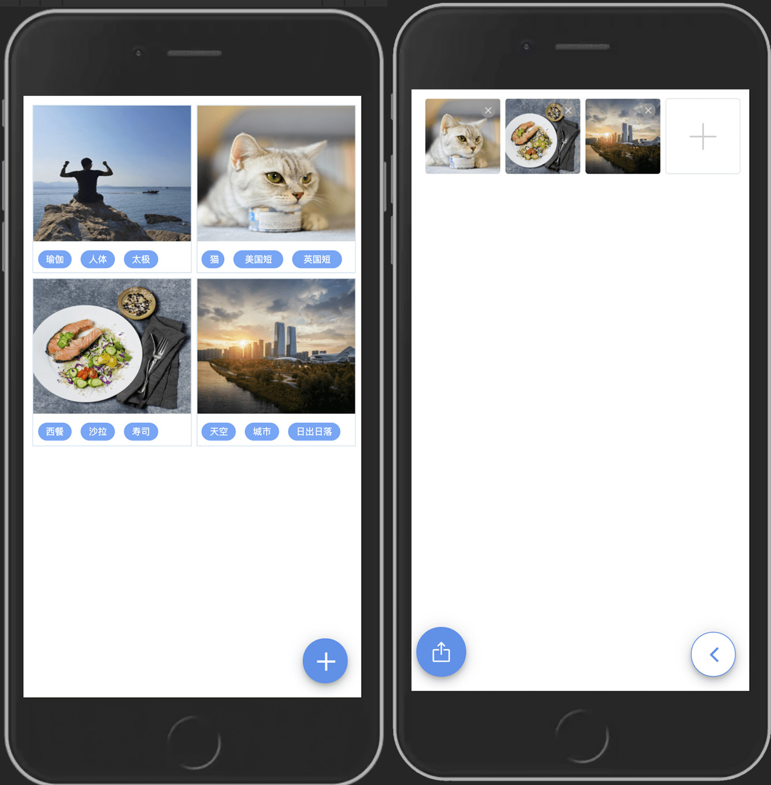

# Serverless 相册

[在线体验](https://photo.sls.plus) (使用手机访问体验最佳)

[](https://github.com/serverless-plus/photo-album/actions?query=workflow:Validate+branch:master)
[](https://github.com/semantic-release/semantic-release)

Serverless 相册应用，**上传照片可以智能识别，添加属性标签**。

> 注意：目前并未添加用户登录逻辑，只是在用户第一次访问应用时，自动生成了一个 `uuid` 作为唯一标识，然后存放到了 LocalStorage 中，如果是发布到小程序，开发者可以自行添加登录逻辑。

## 功能

- [x] [Serverless](https://github.com/serverless/serverless)
- [x] [Taro](https://github.com/nervjs/taro)
- [x] [Taro UI](https://github.com/NervJS/taro-ui)
- [x] [Express](https://github.com/expressjs/express)
- [x] [Typescript](https://github.com/microsoft/TypeScript)
- [x] [Github Actions](https://github.com/features/actions)
- [x] [Eslint](https://github.com/eslint/eslint)
- [x] [Prettier](https://github.com/prettier/prettier)
- [x] [Jest](https://github.com/facebook/jest)
- [x] [semantic-release](https://github.com/semantic-release/semantic-release)

### 使用的云端服务

- [x] [对象存储](https://console.cloud.tencent.com/cos)
- [x] [云函数](https://console.cloud.tencent.com/scf)
- [x] [API 网关](https://console.cloud.tencent.com/apigateway)
- [x] [Serverless MYSQL 数据库](https://console.cloud.tencent.com/cynosdb)
- [x] [图像识别](https://console.cloud.tencent.com/tiia/detectlabel)

> 注意：由于图片识别依赖腾讯云的 [图像标签](https://console.cloud.tencent.com/tiia/detectlabel) 服务，使用前请到控制台开通。

## TODO

- [x] 列表页
- [x] 图片上传
- [x] 图片自动添加标签
- [x] 图片自动添加描述
- [ ] 相册分类
- [ ] 用户登录
- [ ] 小程序授权登录（将单独使用 `weapp` 分支开发）

## 目录介绍

```
.
├── README.md               // 说明文档
├── client                  // 客户端代码
├── cos                     // Serverless cos 组件配置
├── db                      // Serverless cynosdb(mysql) 组件配置
├── docker-compose.yml      // Docker compose 配置，方便本地模拟数据库链接
├── layer                   // Serverless layer 组件配置
├── serverless.yml          // Serverless express 组件配置
├── sls.ts                  // 云函数入口文件
├── src                     // 服务端代码
├── tsconfig.json           // Typescript 配置
└── vpc                     // Serverless vpc 组件配置
```

## 演示

<center>

</center>

## 使用

```bash
$ git clone https://github.com/serverless-plus/photo-album.git
```

或者通过 [serverless](https://github.com/serverless/serverless) 命令初始化：

```bash
$ sls init photo-album
```

> 注意：通过 `sls init` 命令初始化时，会自动安装项目的依赖（执行 `npm install`），时间可能比较长，请耐心等待。如果由于网络原因导致依赖安装失败，可以重新进入项目目录，执行 npm install 来安装依赖。

## 本地开发

安装依赖:

```bash
$ npm install && cd client && npm install
```

本地启动 Docker 服务：

```bash
$ npm run docker:up
```

复制 `.env.example` 为 `.env`，然后配置成个人账号，主要需要配置（`TENCENT_APP_ID`、`TENCENT_SECRET_ID`、`TENCENT_SECRET_KEY`）:

```bash
$ cp .env.example .env
```

启动服务端

```bash
$ npm run dev:server
```

启动客户端：

```bash
$ npm run dev:client
```

## 部署应用

### 部署数据库

Serverless MYSQL 数据库，需要配置私有网络（VPC），隐私我们需要先创建私有网络：

```bash
$ npm run deploy:vpc
```

VPC 创建成功后，再部署数据库

```bash
$ npm run deploy:db
```

### 创建存储桶

创建用来存储相片的存储桶：

```bash
$ npm run deploy:cos
```

### 部署层

针对 Node.js 项目, 我们可以将 `node_modules` 文件夹部署到层，第一次将 `node_modules` 部署到层后，就不用再次重复部署了，这样可以打打减少代码上传体积。

```bash
$ npm run deploy:layer
```

> **注意**： 层部署成功后，如果我们新增了模块依赖（改变了 `node_modules`）就需要再次执行部署层命令。

### 部署服务端代码

```bash
$ npm run deploy:server
```

### 部署客户端代码

```bash
$ npm run deploy:client
```

## License

MIT License

Copyright (c) 2020 Serverless Plus
